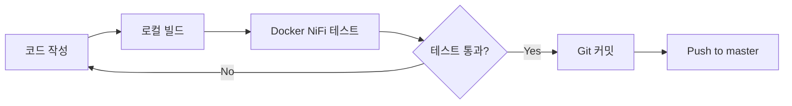
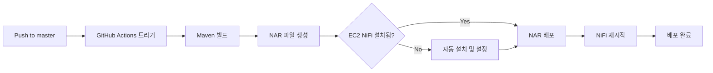

# NiFi Custom Processors

Apache NiFi용 커스텀 프로세서 개발 및 배포 프로젝트입니다.

## 📋 프로젝트 개요

이 프로젝트는 Apache NiFi 2.5.0 기반의 커스텀 프로세서를 개발하고, Docker 환경에서 테스트하며, EC2에 자동 배포하는 완전한 개발-배포 파이프라인을 제공합니다.

### 주요 기능

- ✅ **Docker 기반 개발 환경**: Java/Maven 설치 없이 개발 가능
- ✅ **자동 빌드 시스템**: NAR 파일 자동 생성 및 배포
- ✅ **GitHub Actions CI/CD**: master 브랜치 푸시 시 자동 배포
- ✅ **EC2 완전 자동화**: NiFi 설치부터 NAR 배포까지 자동화

## 🚀 빠른 시작

### 개발 환경 설정

```bash
# 1. 저장소 클론
git clone <repository-url>
cd nifi-develop

# 2. Docker 기반 NiFi 시작
./dev/script/docker-nifi.sh start

# 3. NiFi Web UI 접속
# http://localhost:8080/nifi
```

### 프로세서 개발

```bash
# 1. 프로세서 수정
# nifi-custom-processors/src/main/java/... 파일 편집

# 2. NAR 재빌드 및 NiFi 재시작
./dev/script/docker-nifi.sh reload

# 3. 웹 UI에서 새 프로세서 확인
```

### 자동 배포

```bash
# master 브랜치에 푸시하면 자동 배포
git add .
git commit -m "feat: 새로운 프로세서 추가"
git push origin master

# GitHub Actions가 자동으로:
# - NAR 빌드
# - EC2 배포
# - NiFi 재시작
```

## 📚 상세 문서

### [개발 환경 가이드](dev/README.md)

로컬에서 커스텀 프로세서를 개발하고 테스트하는 방법

- Docker 기반 개발 환경 설정
- NAR 빌드 방법
- NiFi 로컬 실행 및 디버깅
- 스크립트 사용법

### [운영 배포 가이드](prod/README.md)

EC2에 NiFi를 수동으로 배포하는 방법

- EC2 인스턴스 준비
- NiFi 설치 스크립트
- 커스텀 NAR 배포
- 서비스 관리

### [자동 배포 설정](DEPLOYMENT.md)

GitHub Actions를 통한 자동 배포 설정 방법

- GitHub Secrets 설정
- EC2 보안 그룹 설정
- 완전 자동화 배포
- 트러블슈팅

## 🏗️ 프로젝트 구조

```
nifi-develop/
├── nifi-custom-processors/     # 커스텀 프로세서 소스 코드
│   ├── src/main/java/          # Java 소스
│   ├── src/test/java/          # 단위 테스트
│   └── pom.xml
├── nifi-custom-nar/            # NAR 패키징 모듈
│   ├── pom.xml
│   └── target/
│       └── nifi-custom-nar-1.0.0.nar
├── dev/                        # 개발 환경
│   ├── script/
│   │   ├── build-nar.sh        # NAR 빌드 스크립트
│   │   ├── docker-nifi.sh      # Docker NiFi 관리
│   │   └── docker-compose.yml  # Docker 설정
│   └── README.md               # 개발 가이드
├── prod/                       # 운영 배포
│   ├── script/
│   │   ├── nifi-setup.sh       # NiFi 설치 스크립트
│   │   ├── enable-autostart.sh # 자동 시작 설정
│   │   └── deploy-to-ec2.sh    # 수동 배포 스크립트
│   ├── nar/                    # 빌드된 NAR 파일
│   └── README.md               # 배포 가이드
├── .github/workflows/
│   └── deploy-ec2.yml          # GitHub Actions 워크플로우
├── pom.xml                     # Maven 루트 설정
├── DEPLOYMENT.md               # 자동 배포 가이드
└── README.md                   # 이 파일
```

## 🛠️ 기술 스택

### 개발 환경

| 항목 | 버전 | 용도 |
|------|------|------|
| **Apache NiFi** | 2.5.0 | 데이터 플로우 엔진 |
| **Java (JDK)** | 21 | 프로세서 개발 언어 |
| **Maven** | 3.9+ | 빌드 도구 |
| **Docker** | Latest | 개발 환경 컨테이너화 |

### 배포 환경

| 항목 | 버전 | 용도 |
|------|------|------|
| **Amazon Linux** | 2023 | EC2 OS |
| **GitHub Actions** | - | CI/CD 파이프라인 |
| **Systemd** | - | NiFi 서비스 관리 |

## 📖 주요 워크플로우

### 1. 개발 워크플로우



### 2. 배포 워크플로우



## 🔧 요구사항

### 개발 환경

- **필수**: Docker Desktop
- **선택**: Java 21, Maven 3.9+ (Docker 미사용 시)

### 배포 환경

- **EC2 인스턴스**: Amazon Linux 2023
- **보안 그룹**: SSH (22), HTTP (8080) 포트 오픈
- **GitHub Secrets**: EC2 접속 정보

## 📝 주요 명령어

### 개발

```bash
# NAR 빌드
./dev/script/build-nar.sh

# NiFi 시작
./dev/script/docker-nifi.sh start

# NAR 재빌드 + NiFi 재시작
./dev/script/docker-nifi.sh reload

# 로그 확인
./dev/script/docker-nifi.sh logs

# 중지
./dev/script/docker-nifi.sh stop
```

### 배포

```bash
# 자동 배포 (GitHub Actions)
git push origin master

# 수동 배포 (로컬에서 EC2로)
./prod/script/deploy-to-ec2.sh <EC2_HOST>
```

## 🔍 트러블슈팅

### 개발 환경

- **프로세서가 안 보임**: `./dev/script/docker-nifi.sh reload`
- **포트 충돌**: `docker-compose.yml`에서 포트 변경
- **빌드 실패**: `rm -rf .m2-docker/` 후 재빌드

### 배포 환경

- **SSH 연결 실패**: GitHub Secrets의 `EC2_SSH_KEY` 확인
- **NAR 미적용**: EC2에서 `sudo systemctl restart nifi`
- **메모리 부족**: `/opt/nifi/conf/bootstrap.conf`에서 메모리 조정

자세한 내용은 각 문서를 참조하세요.

## 🤝 기여 방법

```bash
# 1. Feature 브랜치 생성
git checkout -b feature/my-processor

# 2. 개발 및 테스트
./dev/script/docker-nifi.sh reload

# 3. 커밋
git add .
git commit -m "feat: MyProcessor 추가"

# 4. Push
git push origin feature/my-processor

# 5. Pull Request 생성
```

## 📄 라이선스

Apache License 2.0

## 🔗 참고 자료

- [Apache NiFi 공식 문서](https://nifi.apache.org/docs.html)
- [NiFi Developer Guide](https://nifi.apache.org/developer-guide.html)
- [GitHub Actions 문서](https://docs.github.com/en/actions)
- [AWS EC2 문서](https://docs.aws.amazon.com/ec2/)

## 📞 문의

프로젝트 관련 문의사항은 GitHub Issues를 이용해주세요.